# TinyRTS

*[English version](README.md)*

Un juego de estrategia en tiempo real para Linux y Windows, en pixel art. Una facción, tú contra hasta tres IAs en
todos contra todos, campamentos neutrales que limpiar a cambio de recompensas, mesetas y escaleras, niebla de guerra
y un editor de mapas dentro del propio juego. Un Warcraft 3 en pequeño con la economía de expansión de Northgard.

Hecho desde cero en **Godot 4.6 .NET y C#**, con el arte del pack *Tiny Swords* de Pixel Frog.

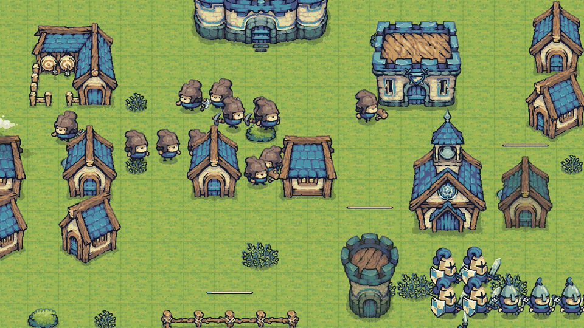

## Qué se hace en una partida

Empiezas con un Castillo, tres Peones y unos pocos recursos. Los Peones talan, pican oro y llevan cada carga al
Castillo a mano; los árboles dejan tocón y las vetas se agotan, así que antes o después levantas un segundo Castillo
sobre el siguiente grupo de recursos. Los corrales dan comida sin trabajo. Las Casas suben la población; el Cuartel,
la Arquería y el Monasterio entrenan Guerreros, Arqueros, Lanceros y Monjes, y nueve tecnologías en tres ramas lo
afilan todo.

El mapa se comparte con campamentos neutrales: goblins, trolls, nidos de arañas, guaridas de ladrones, calas piratas
en el agua. Cada uno tiene guardianes, un puesto fijo que defienden, regeneración si los dejas en paz y una
recompensa al limpiarlo. Mercados, mercenarios y tabernas neutrales esperan en el centro del mapa a quien llegue
primero.

Gana el último jugador con un Castillo en pie.

| | |
| --- | --- |
| 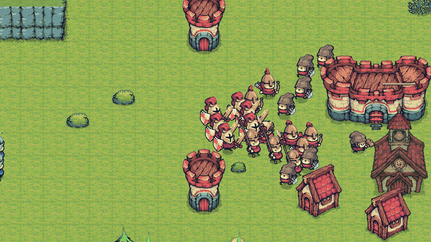 | 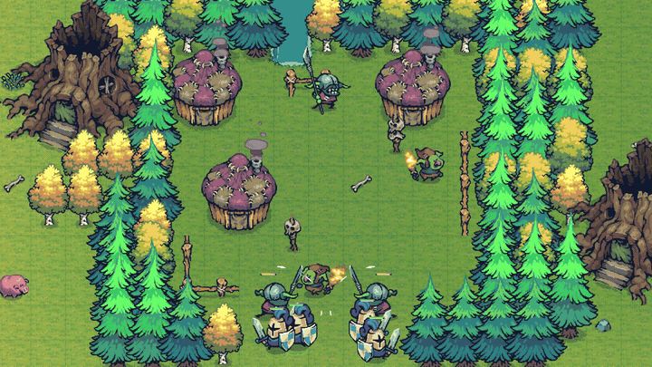 |
| Una batalla entre jugadores | Limpiando un campamento neutral |
| 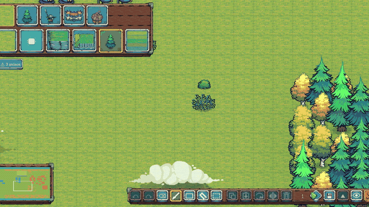 | 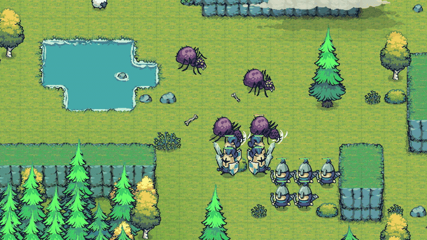 |
| El editor de mapas | Un nido de arañas |

## Características

- **Simulación en tiempo real** a paso fijo de 20 Hz, dibujada a 60 fps interpolando entre ticks.
- **Movimiento libre en píxeles**: A* sobre la cuadrícula de 64 px sin cortar esquinas, suavizado del camino y
  separación local por hash espacial. Las unidades nunca bloquean casillas; edificios, recursos y terreno sí.
  200 unidades cruzan el mapa a 60 fps.
- **Una economía de viajes**: árboles y vetas finitos, Peones que recolectan, se cargan y entregan, comida pasiva de
  los corrales y expansión con un segundo Castillo. Mercado, mercenarios y taberna neutrales.
- **Altura que cuenta**: mesetas y acantilados unidos solo por escaleras laterales de una casilla. Las unidades a
  distancia y las torres ganan alcance y visión desde arriba; el cuerpo a cuerpo nunca cruza un borde.
- **21 tipos de campamento neutral** con 24 criaturas del Enemy Pack, incluidos guardianes estáticos de agua como el
  tiburón arponero y el pez bomba. El mapa de cuatro jugadores tiene 33 campamentos.
- **IA rival** para dos a cuatro jugadores que se expande, comercia en el mercado, levanta torres camino del enemigo
  y elige el objetivo de cada oleada por distancia o debilidad. Ajustada jugando cientos de partidas simuladas,
  porque la simulación no tiene azar y una sola partida es una muestra caótica, no una medida.
- **Niebla de guerra** de tres estados, minimapa con avisos y controles de Warcraft 3: recuadro, click derecho
  contextual, atacar en movimiento, parar y mantener, grupos de control, bordes y WASD. Todas las teclas se pueden
  reasignar.
- **Editor de mapas** al estilo Mario Maker: se pinta terreno, recursos, campamentos y posiciones de salida sobre el
  mundo real, P prueba el mapa en menos de una décima de segundo y Esc devuelve al editor. Pincel, rectángulo, cubo y
  selección, copiar y pegar, girar y espejar, y un comprobador que avisa de bases inaccesibles, recursos vigilados o
  falta de sitio para construir.
- **Tres mapas oficiales**: el Valle (96×64, dos jugadores), La Encrucijada (160×160, cuatro jugadores, simetría
  rotacional) y Cuatro vientos, hecho con el editor. Los dos primeros salen de generadores en Python que validan
  simetría, conectividad, anchura de los cuellos y distancias entre bases.
- Ranuras de guardado con autoguardado, español e inglés, 59 sonidos, música y ambiente.

## Capturas

| | |
| --- | --- |
| 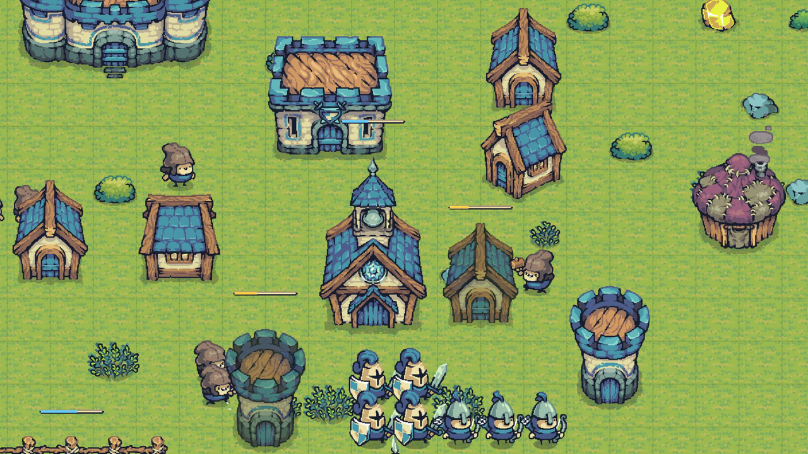 | 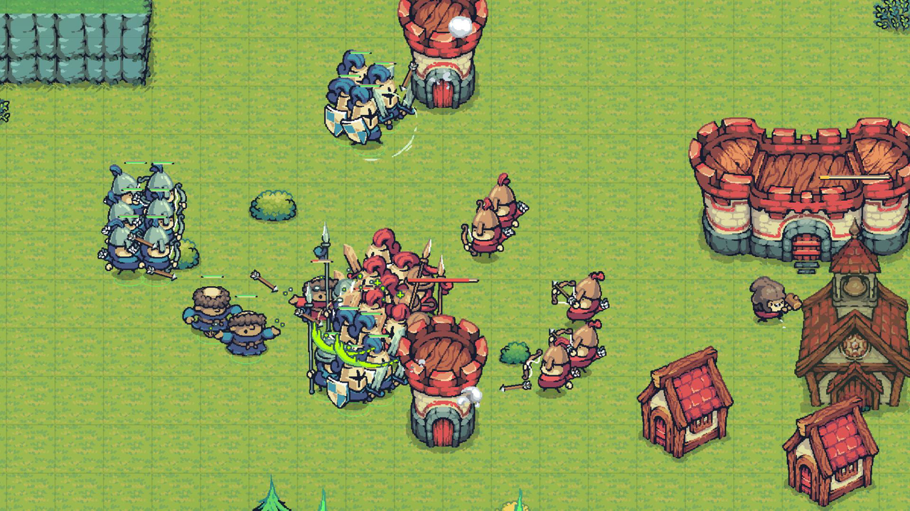 |
| 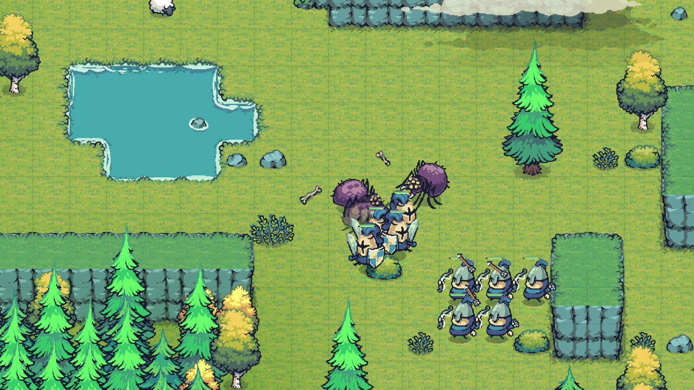 | 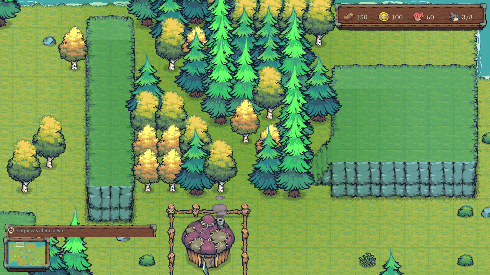 |
| 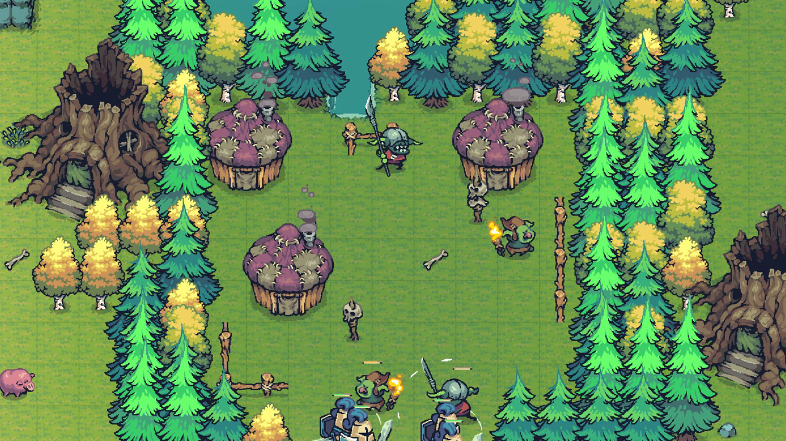 | 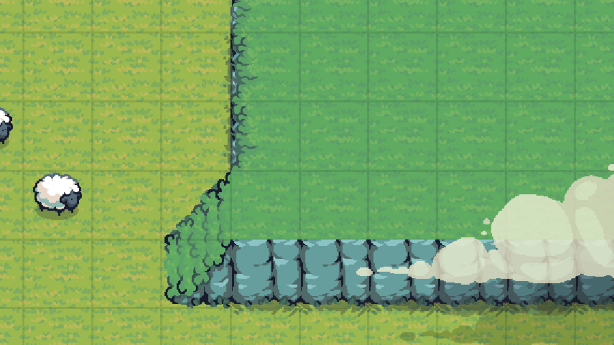 |
| 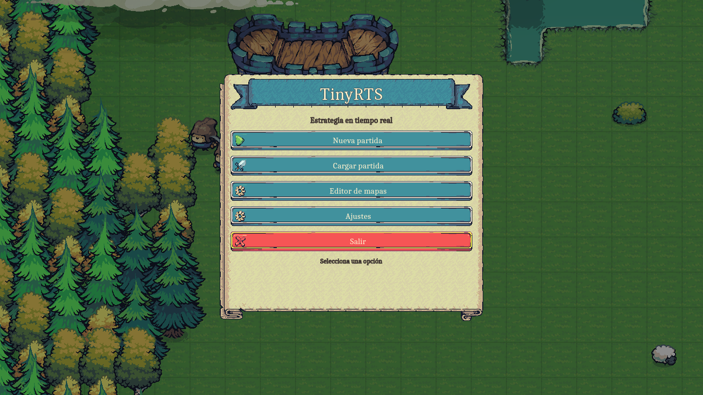 | 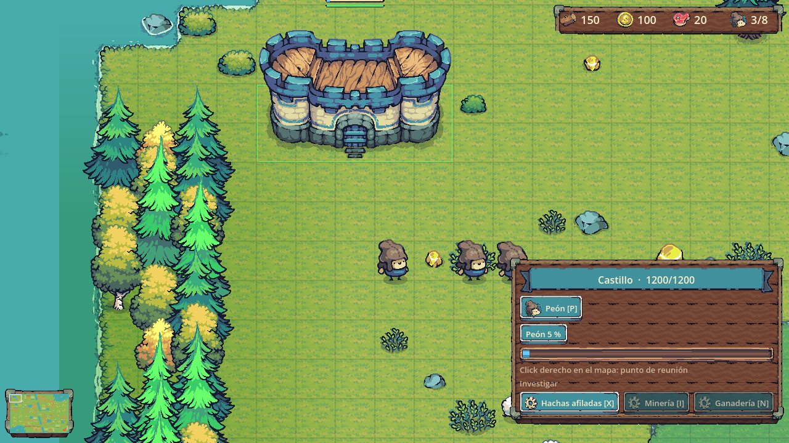 |
| 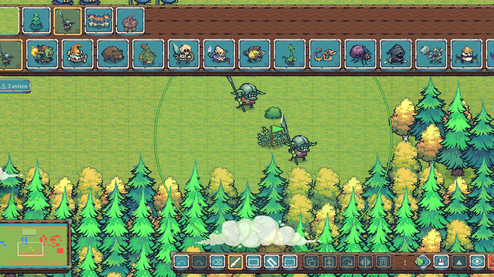 | 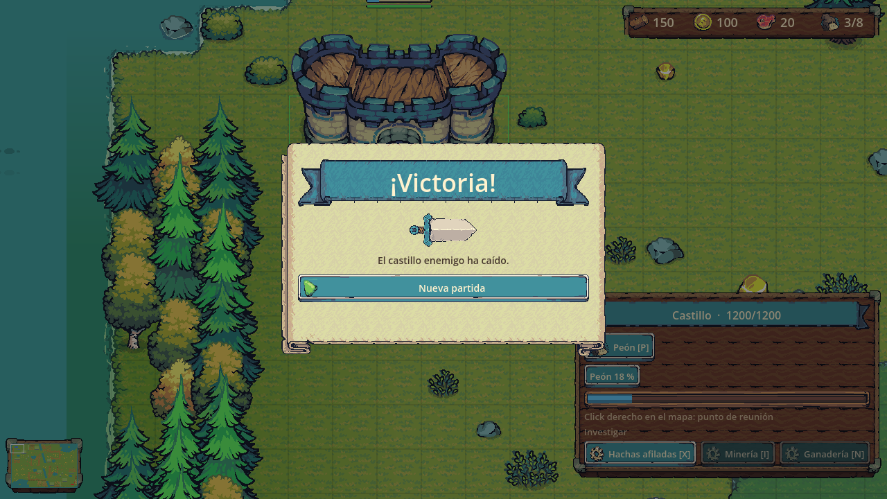 |

## Cómo está hecho

El juego son dos mitades que nunca se mezclan. `src/Game` es la simulación: C# puro, sin nodos de Godot ni delta de
frame, que avanza con `Sim.Step()` a paso fijo, se prueba con xUnit sin abrir el motor y se serializa a JSON para
guardar. `src/Scenes` es la capa de Godot: escenas y vistas que dibujan el estado de la simulación y una interfaz que
nunca toca una entidad. Solo encola órdenes, igual que la IA.

Esa separación es lo que hace posible el resto. La batería de tests juega partidas enteras: diez minutos de IA contra
IA en el Valle y quince con cuatro IAs en La Encrucijada corren sin ventana en unos treinta segundos, y comprueban
cosas como "nadie es eliminado antes del minuto diez" o "ninguna IA se queda ociosa un minuto". Un arnés de línea de
comandos maneja el motor real con entrada sintética y órdenes con guion, saca capturas y mide el tiempo por frame, así
que cualquier cambio se verifica sin ratón.

| | |
| --- | --- |
| Motor | Godot 4.6.2 .NET, C# 12 sobre .NET 8, sin más dependencias |
| Render | Compatibility (OpenGL 3.3), filtro nearest, ajuste al píxel |
| Código | Unas 16.000 líneas de C# en 88 ficheros, más 4.300 de tests |
| Tests | 181, incluidas partidas simuladas completas |
| Rendimiento | 4 IAs y 300 unidades a 60 fps con un tick de simulación de 1,3 ms |
| Contenido | 29 tipos de unidad, 7 edificios, 9 tecnologías, 21 tipos de campamento, 3 mapas |
| Textos | 519 cadenas traducidas a español e inglés |

El terreno y las capas estáticas son comandos de dibujo retenidos, no nodos; solo lo que se anima es un sprite; los
anillos de selección, la espuma y las sombras son nodos únicos que se redibujan cuando algo cambia. La escena entera se
queda en torno a una docena de draw calls con cientos de unidades en pantalla.

El proyecto se ha hecho con Claude Code programando y conmigo dirigiendo el diseño, jugando cada build y decidiendo
qué entra y qué se descarta. El repositorio con el código es privado; este es la presentación pública.

## Estado

Jugable de principio a fin: economía, construcción, entrenamiento, combate, tecnología, IA para dos y cuatro
jugadores, campamentos neutrales, guardado, audio, editor y dos idiomas. El desarrollo empezó el 8 de septiembre de
2026. La hoja de ruta apunta a Steam, y por eso las estadísticas de partida ya viven en la simulación y cada guardado
es un fichero por ranura.

## La web

Este repositorio es la web del juego: React, Vite y TypeScript, con la interfaz de Tiny Swords sobre una aldea viva
pintada en un canvas (el mismo mundo que mi portfolio). Los textos están en `src/content/`, un fichero por idioma.

```
npm install
npm run dev        # http://localhost:5173
npm run build      # sitio estático en dist/
npm run test:e2e   # Playwright; la primera vez: npx playwright install chromium
```

## Créditos

- Arte: [Tiny Swords](https://pixelfrog-assets.itch.io/tiny-swords) y su Enemy Pack, de Pixel Frog, usados bajo su
  licencia. La web usa sprites recortados de los mismos packs.
- Tipografía: Pixelify Sans, de Stefie Justprince, SIL Open Font License.
- Sonidos: Pixabay.
- Motor: Godot Engine.

Las capturas, el vídeo y los textos de este repositorio son © 2026 9n-dev. Ver [LICENSE](LICENSE).
